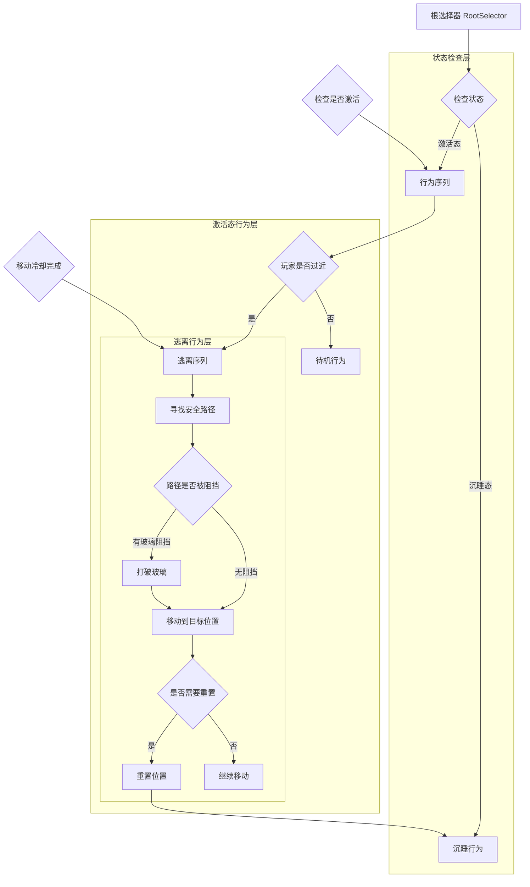

# 岩石行为树文档

## 概述
本文档详细描述了游戏中岩石对象的行为树设计，包含其状态转换逻辑、行为决策过程和执行机制。岩石具有两种主要状态：沉睡态和激活态，在不同状态下会表现出不同的行为模式。

## 行为树需求

1. **沉睡状态**：在沉睡状态下，岩石保持静止，不执行任何主动行为
2. **状态转换**：当满足特定条件时，岩石从沉睡态转变为激活态
3. **激活行为**：在激活态下，岩石会主动远离玩家
4. **寻路与障碍处理**：远离时会自动寻路，如果被玻璃阻挡，会打破玻璃继续移动

## 行为树设计 (Mermaid)



## 节点详细解释

### 根节点和状态控制

#### RootSelector
- **类型**：选择器节点 (BTSelector)
- **功能**：作为行为树的根节点，负责根据岩石当前状态选择执行合适的行为分支
- **执行逻辑**：按顺序评估子节点，返回第一个成功或运行中的子节点状态，忽略后续节点
- **重要性**：决定整个行为树的执行流程和状态切换

#### StateCheck
- **类型**：条件节点 (BTConditionNode)
- **功能**：判断岩石当前的状态（沉睡或激活）
- **实现细节**：检查`Rock`组件的`CurrentState`属性
- **返回值**：根据状态返回不同的子节点路径

#### CheckAwake
- **类型**：条件装饰器节点 (BTConditionDecorator)
- **功能**：确保只有激活状态的岩石才会执行后续行为
- **实现**：封装`ActionSequence`，前置检查`_rockComponent.CurrentState == Rock.RockState.Awake`
- **返回值**：如果岩石未激活，直接返回失败，跳过子节点执行

### 沉睡状态行为

#### SleepAction
- **类型**：动作节点 (BTActionNode)
- **功能**：沉睡状态行为节点，使岩石保持静止
- **实现细节**：
  ```csharp
  return () => {
      // 沉睡状态下，设置刚体为静态
      _rigidbody.bodyType = RigidbodyType2D.Static;
      return BTNodeState.Success;
  };
  ```
- **返回值**：始终返回成功，因为无需执行复杂操作

### 激活状态行为

#### ActionSequence
- **类型**：序列节点 (BTSequence)
- **功能**：激活状态下的行为序列，按顺序执行子节点
- **执行逻辑**：只有当所有子节点都成功时才返回成功，如果任何子节点失败则立即终止执行
- **用途**：组织激活态下的多个连续行为，确保逻辑顺序执行

#### EscapeCondition
- **类型**：条件节点 (BTConditionNode)
- **功能**：检查玩家是否在安全距离内，决定是否需要逃离
- **实现细节**：
  ```csharp
  return () => {
      if (_player == null) return BTNodeState.Failure;
      float distance = Vector3.Distance(transform.position, _player.transform.position);
      return distance < _safeDistance ? BTNodeState.Success : BTNodeState.Failure;
  };
  ```
- **参数**：安全距离`_safeDistance`，默认为6f

#### IdleAction
- **类型**：动作节点 (BTActionNode)
- **功能**：当玩家不在安全距离内时，执行待机行为
- **实现细节**：简单地记录日志并返回成功
- **返回值**：始终返回成功

#### CheckMovementCooldown
- **类型**：条件装饰器节点 (BTConditionDecorator)
- **功能**：检查移动冷却时间是否已过，避免过于频繁地移动
- **实现**：检查`Time.time >= _lastMovementTime + _movementCooldown`
- **参数**：移动冷却时间`_movementCooldown`，默认为2f

### 逃离行为

#### EscapeSequence
- **类型**：序列节点 (BTSequence)
- **功能**：逃离行为序列，包含寻找路径、处理障碍和移动的逻辑
- **执行流程**：按顺序执行寻路、障碍检测、移动等操作

#### FindPath
- **类型**：动作节点 (BTActionNode)
- **功能**：寻找远离玩家的安全路径
- **实现细节**：
  - 计算远离玩家的基础方向
  - 尝试多个方向（0°、45°、-45°、90°、-90°）
  - 对每个方向进行碰撞检测
  - 如果都失败，选择随机方向
- **返回值**：找到有效路径返回成功，否则返回失败

#### PathCheck
- **类型**：选择器节点 (BTSelector)
- **功能**：检查路径是否被障碍物阻挡，并选择相应的处理方式
- **执行逻辑**：先检查无障碍路径，如失败则尝试打破玻璃路径
- **重要性**：实现玻璃打破机制的决策点

#### BreakGlass
- **类型**：动作节点 (BTActionNode)
- **功能**：当路径被玻璃阻挡时，执行打破玻璃的行为
- **实现细节**：
  ```csharp
  return () => {
      // 获取路径上的玻璃对象
      var glassObjects = Physics2D.OverlapCircleAll(targetPosition, 0.5f)
          .Where(col => col.CompareTag("Glass")).ToArray();
      
      // 打破所有玻璃
      foreach (var glass in glassObjects) {
          // 触发玻璃破碎逻辑
          var glassComponent = glass.GetComponent<Glass>();
          glassComponent?.Break();
      }
      
      return BTNodeState.Success;
  };
  ```
- **返回值**：成功打破所有阻挡的玻璃后返回成功

#### MoveToTarget
- **类型**：动作节点 (BTActionNode)
- **功能**：向目标位置移动
- **实现细节**：
  ```csharp
  return () => {
      if (_moveTarget == Vector3.zero) return BTNodeState.Failure;
      
      Vector3 direction = (_moveTarget - transform.position).normalized;
      float distance = Vector3.Distance(transform.position, _moveTarget);
      
      if (distance < 0.1f) {
          // 到达目标
          transform.position = _moveTarget;
          _isMoving = false;
          _moveTarget = Vector3.zero;
          return BTNodeState.Success;
      } else {
          // 继续移动
          transform.position += direction * _movementSpeed * Time.deltaTime;
          return BTNodeState.Running;
      }
  };
  ```
- **状态转换**：到达目标返回成功，移动中返回运行中
- **参数**：移动速度`_movementSpeed`，默认为2f

#### ResetCheck
- **类型**：条件节点 (BTConditionNode)
- **功能**：检查是否需要重置位置（例如逃离尝试次数过多）
- **实现**：检查`_escapeAttemptCount >= _maxEscapeAttempts`
- **参数**：最大尝试次数`_maxEscapeAttempts`，默认为5次

#### ResetPosition
- **类型**：动作节点 (BTActionNode)
- **功能**：将岩石重置到初始位置
- **实现细节**：
  ```csharp
  return () => {
      transform.position = _originalPosition;
      _isMoving = false;
      _moveTarget = Vector3.zero;
      _escapeAttemptCount = 0;
      return BTNodeState.Success;
  };
  ```
- **返回值**：重置完成后返回成功

#### ContinueMovement
- **类型**：动作节点 (BTActionNode)
- **功能**：继续当前移动行为
- **实现细节**：如果已经设置了移动目标但尚未到达，保持移动状态
- **返回值**：正在移动时返回运行中，否则返回成功

## 实现细节

### 状态管理
- **状态定义**：岩石状态通过`Rock.RockState`枚举定义，包括`Sleeping`和`Awake`两种状态
- **状态切换**：状态切换由外部条件触发（暂不通过玩家距离自动切换），行为树根据当前状态选择不同的行为路径
- **持久化**：状态信息在`Rock`组件中持久化保存，行为树每次执行时读取当前状态

### 寻路机制
- **实现方式**：采用简化的多方向尝试寻路算法，适合小型2D场景
- **寻路策略**：
  1. 首先计算远离玩家的基础方向向量
  2. 尝试多个预设角度（0°、45°、-45°、90°、-90°）
  3. 对每个方向进行射线检测或碰撞体检测
  4. 选择第一个无障碍的方向作为移动目标
  5. 如果所有方向都被阻挡，则选择随机方向尝试逃离
- **目标设置**：计算安全距离（默认为3f）外的目标位置

### 障碍物处理
- **检测方式**：
  - 使用`Physics2D.Raycast`进行路径障碍检测
  - 使用`Physics2D.OverlapCircleAll`进行目标位置障碍物检测
- **玻璃特殊处理**：
  - 通过标签`"Glass"`识别玻璃对象
  - 调用玻璃组件的`Break()`方法触发破碎效果
  - 破碎后可以继续向原路径移动
- **失败处理**：当所有方向都无法移动时，增加尝试次数计数，达到阈值后重置位置

### 移动控制
- **移动方式**：使用线性插值移动，确保平滑移动效果
- **状态跟踪**：
  - 使用`_isMoving`标志跟踪移动状态
  - 使用`_moveTarget`保存目标位置
  - 通过距离检测判断是否到达目标
- **冷却机制**：添加`_movementCooldown`控制移动频率，避免过于频繁的位置更新

## 性能优化建议

1. **减少物理检测频率**：
   - 射线检测和碰撞检测是相对昂贵的操作
   - 建议在低频率下执行复杂检测，如每帧只检测一次或每N帧检测一次
   - 可以使用协程来控制检测频率

2. **引用缓存**：
   - 缓存`_player`引用，避免每帧查找玩家对象
   - 缓存`_rockComponent`和`_rigidbody`组件引用
   - 示例：
     ```csharp
     private void Awake() {
         _rockComponent = GetComponent<Rock>();
         _rigidbody = GetComponent<Rigidbody2D>();
         _player = GameObject.FindWithTag("Player");
     }
     ```

3. **简化碰撞检测**：
   - 对于寻路时的碰撞检测，可以使用更简化的碰撞体
   - 考虑使用层过滤，只检测特定类型的障碍物
   - 示例：
     ```csharp
     int obstacleLayerMask = 1 << LayerMask.NameToLayer("Obstacle");
     RaycastHit2D hit = Physics2D.Raycast(transform.position, direction, distance, obstacleLayerMask);
     ```

4. **移动优化**：
   - 限制移动距离，每次移动的目标点不宜设置得太远
   - 使用固定更新（FixedUpdate）处理物理相关的移动
   - 考虑使用对象池管理破碎的玻璃对象

5. **批处理**：
   - 在需要打破玻璃时，使用`OverlapCircleAll`批量检测玻璃对象
   - 合并多次检测为单次更广泛的检测

## 使用说明

### 基本设置
1. 在岩石预制体上挂载`Rock`和`RockBehaviorTree`组件
2. 确保预制体有正确的碰撞体和刚体组件
3. 在场景中放置玩家对象，并确保其标签为"Player"

### 配置参数
- **行为树参数**：
  - `_safeDistance`：安全距离，默认为6f
  - `_movementCooldown`：移动冷却时间，默认为2f
  - `_movementSpeed`：移动速度，默认为2f
  - `_maxEscapeAttempts`：最大逃离尝试次数，默认为5次
- **Rock组件参数**：
  - `_wakeUpDistance`：暂保留供后续功能使用
  - `_sleepDistance`：暂保留供后续功能使用

### 状态切换
- 当前状态切换不由玩家距离自动触发，需要通过外部调用
- 示例状态切换代码：
  ```csharp
  // 激活岩石
  rockComponent.CurrentState = Rock.RockState.Awake;
  
  // 使岩石沉睡
  rockComponent.CurrentState = Rock.RockState.Sleeping;
  ```

### 调试功能
- 启用`OnDrawGizmosSelected`方法可视化行为树状态和决策过程
- 可以通过`Debug.Log`或`Log`类输出关键执行信息

## 后续扩展建议

1. **状态扩展**：
   - 添加更多的状态，如"防御态"、"攻击态"、"疲惫态"等
   - 实现更复杂的状态转换逻辑和条件判断

2. **寻路算法增强**：
   - 实现更复杂的寻路算法，如A*寻路
   - 考虑地形高度、可通行性等因素
   - 添加动态障碍物回避能力

3. **障碍物系统升级**：
   - 添加对不同障碍物类型的特殊处理
   - 实现可破坏障碍物的耐久度系统
   - 添加地形记忆功能，避免重复尝试相同路径

4. **行为多样性**：
   - 实现更丰富的移动模式，如跳跃、滚动、攀爬等
   - 添加随机行为元素，使岩石行为更加自然
   - 实现群体行为，多个岩石协同行动

5. **感知系统**：
   - 添加视野或听力系统，实现更真实的感知机制
   - 引入记忆系统，记住玩家的位置和行为模式
   - 实现决策权重系统，根据多种因素综合决策

6. **性能优化**：
   - 实现LOD系统，远处的岩石使用简化的行为逻辑
   - 使用多线程处理复杂的AI计算
   - 实现行为预计算和缓存机制

## 调试信息
在Unity编辑器中，可以通过Gizmos查看岩石的安全距离范围、移动目标和当前状态，便于调试和优化行为树。