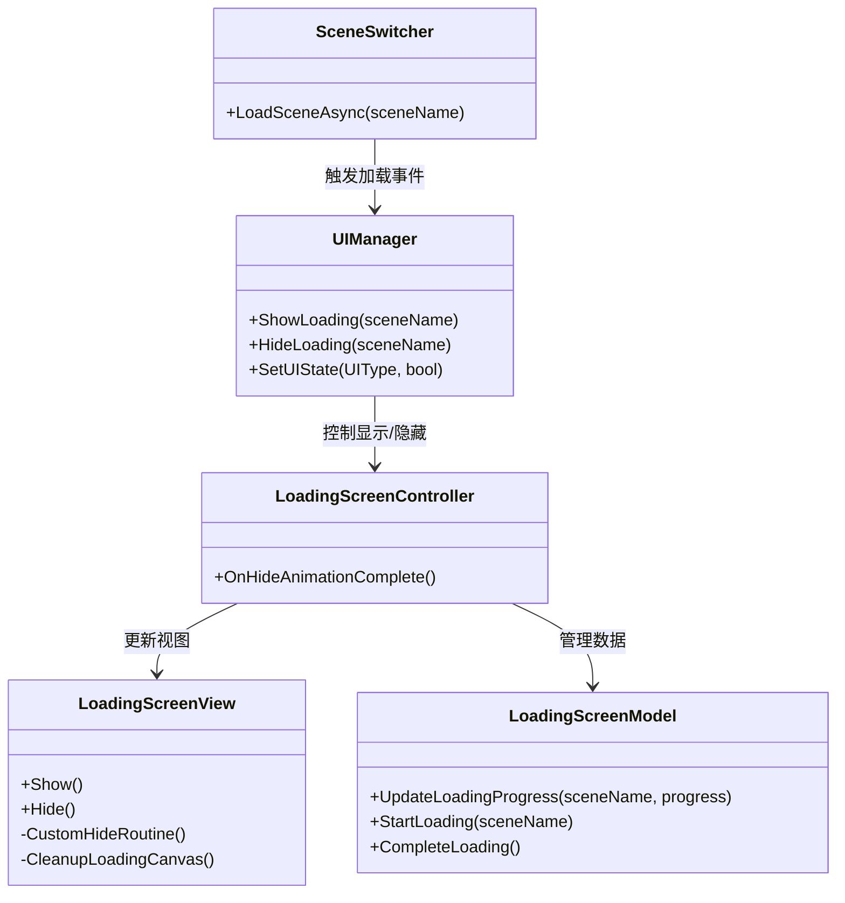
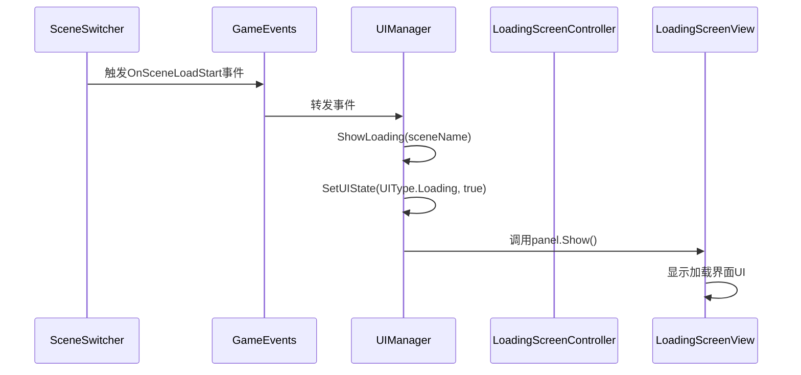
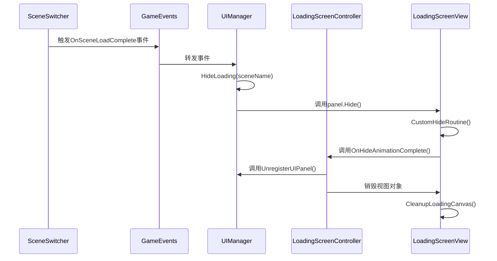

# 加载界面技术方案

## 1. 概述

加载界面（LoadingScreen）是游戏中在场景切换或资源加载时向玩家显示加载状态的关键UI组件。本技术方案文档详细说明加载界面的架构设计、实现原理和关键流程，确保加载界面在跨场景切换过程中稳定显示并正确销毁。

## 2. 架构设计

加载界面采用MVC（Model-View-Controller）架构模式，各层职责清晰分离：

### 2.1 整体架构



### 2.2 组件职责

| 组件 | 职责 | 文件位置 | <mcfile>引用 |
|------|------|----------|-------------|
| LoadingScreenController | 处理加载界面的逻辑、事件响应和与视图的交互 | Controller/LoadingScreenController.cs | <mcfile name="LoadingScreenController.cs" path="d:\Unity Projects\GameJamToolPack\Assets\Scripts\UI\Loading\Controller\LoadingScreenController.cs"></mcfile> |
| LoadingScreenView | 负责显示加载界面的UI元素和动画效果 | View/LoadingScreenView.cs | <mcfile name="LoadingScreenView.cs" path="d:\Unity Projects\GameJamToolPack\Assets\Scripts\UI\Loading\View\LoadingScreenView.cs"></mcfile> |
| LoadingScreenModel | 管理加载界面相关的数据和业务逻辑 | Model/LoadingScreenModel.cs | <mcfile name="LoadingScreenModel.cs" path="d:\Unity Projects\GameJamToolPack\Assets\Scripts\UI\Loading\Model\LoadingScreenModel.cs"></mcfile> |
| UIManager | 统一管理UI面板的显示/隐藏，处理加载界面的触发逻辑 | Core/UIManager.cs | <mcfile name="UIManager.cs" path="d:\Unity Projects\GameJamToolPack\Assets\Scripts\UI\Core\UIManager.cs"></mcfile> |
| SceneSwitcher | 处理场景加载逻辑，触发加载开始/完成事件 | Core/Scene/SceneSwitcher.cs | <mcfile name="SceneSwitcher.cs" path="d:\Unity Projects\GameJamToolPack\Assets\Scripts\Core\Scene\SceneSwitcher.cs"></mcfile> |

## 3. 核心功能实现

### 3.1 跨场景显示机制

加载界面能够在场景切换过程中保持显示，主要依赖于以下机制：

1. **预制体自带Canvas**：加载界面预制体已被重置为包含自己的Canvas组件，实例化时直接实例化整个预制体，确保Canvas作为加载界面的一部分存在
2. **静态Canvas引用**：通过LoadingScreenView中的静态字段s_loadingCanvas跟踪Canvas对象
3. **延迟销毁逻辑**：在隐藏动画完成后，通过延迟销毁机制确保资源正确释放

### 3.2 加载界面显示流程



### 3.3 加载界面隐藏流程



## 4. 关键代码实现

### 4.1 加载界面显示实现 (UIManager)

```csharp
/// <summary>
/// 场景加载开始时显示加载界面
/// </summary>
/// <param name="sceneName">要加载的场景名称</param>
private void ShowLoading(string sceneName)
{
    Log.Info(module, "场景加载开始，显示加载界面");
    SetUIState(UIType.Loading, true);
    // 记录加载界面显示的开始时间
    m_loadingStartTime = Time.unscaledTime;
}
```

### 4.2 加载界面隐藏实现 (UIManager)

```csharp
/// <summary>
/// 场景加载完成时隐藏加载界面
/// </summary>
/// <param name="sceneName">已加载完成的场景名称</param>
private void HideLoading(string sceneName)
{
    Log.Info(module, "场景加载完成，开始隐藏加载界面");
    
    // 检查Loading面板是否已经注册，如果没有则等待并延迟隐藏
    if (!PanelMap.ContainsKey(UIType.Loading))
    {
        Log.Info(module, "Loading面板尚未加载完成，将延迟隐藏");
        StartCoroutine(WaitAndHideLoading());
    }
    else
    {
        // 计算加载界面已经显示的时间
        float loadingDisplayedTime = Time.unscaledTime - m_loadingStartTime;
        
        // 如果加载界面显示时间不足最小显示时间，则等待足够的时间再隐藏
        if (loadingDisplayedTime < m_minLoadingDisplayTime)
        {
            Log.Info(module, "加载界面显示时间不足，将等待至最小显示时间后隐藏");
            StartCoroutine(WaitForMinLoadingTime());
        }
        else
        {
            // 如果面板已注册且显示时间足够，则直接隐藏
            SetUIState(UIType.Loading, false);
        }
    }
}
```

### 4.3 加载界面视图隐藏实现 (LoadingScreenView)

```csharp
/// <summary>
/// 隐藏加载界面
/// 重写IUIPanel接口的Hide方法，添加完成回调支持
/// </summary>
public override void Hide()
{
    Log.Info(LOG_MODULE, "隐藏加载界面");
    // 自定义淡出动画完成后的行为：销毁加载界面
    StartCoroutine(CustomHideRoutine());
}

/// <summary>
/// 自定义隐藏协程
/// 执行淡出动画后触发隐藏完成事件并销毁加载界面
/// </summary>
private System.Collections.IEnumerator CustomHideRoutine()
{
    // 播放淡出动画
    if (IsVisible)
    {
        yield return StartCoroutine(base.FadeOut(() => 
        {
            gameObject.SetActive(false);
        }));
    }
    
    // 动画播放完成后，通知控制器可以进行场景切换
    if (m_controller != null)
    {
        var loadingController = m_controller as LoadingScreenController;
        if (loadingController != null)
        {
            loadingController.OnHideAnimationComplete();
        }
    }
    
    // 延迟一帧后清理Canvas，确保对象销毁顺序正确
    yield return null;
    
    // 清理加载Canvas（如果没有其他子对象）
    // 注意：当加载界面预制体自带Canvas时，此方法主要用于处理特殊情况下的Canvas清理
    CleanupLoadingCanvas();
    
    Log.Info(LOG_MODULE, "加载界面淡出动画播放完成，已请求清理Canvas");
}

/// <summary>
/// 清理加载Canvas
/// </summary>
private static void CleanupLoadingCanvas()
{
    if (s_loadingCanvas != null)
    {
        // 检查Canvas下是否还有其他子对象
        if (s_loadingCanvas.transform.childCount == 0)
        {
            Log.Info(LOG_MODULE, "加载Canvas下没有子对象，准备销毁");
            UnityEngine.Object.Destroy(s_loadingCanvas);
            s_loadingCanvas = null;
        }
    }
}
```

### 4.4 加载界面控制器实现 (LoadingScreenController)

```csharp
/// <summary>
/// 当加载界面隐藏动画播放完成时调用
/// 负责清理加载界面资源
/// </summary>
public void OnHideAnimationComplete()
{
    Log.Info(LOG_MODULE, "加载界面隐藏动画播放完成，清理加载界面资源");
    
    if (m_view != null && m_view.gameObject != null)
    {
        Log.Info(LOG_MODULE, "准备销毁加载界面对象（已添加到DontDestroyOnLoad Canvas）");
        
        // 确保UIManager注销此面板
        if (UIManager.Instance != null)
        {
            UIManager.Instance.UnregisterUIPanel(UIType.Loading);
        }
        
        // 延迟一帧后销毁，确保所有事件都已处理完成
        // 由于加载界面预制体自带Canvas，销毁视图对象时将连带销毁其包含的Canvas
        UnityEngine.Object.Destroy(m_view.gameObject, 0.1f);
    }
}
```

## 5. 性能优化策略

### 5.1 最小显示时间机制

为了避免加载界面闪烁（加载过快导致），系统实现了最小显示时间机制：

```csharp
// 在UIManager的HideLoading方法中
float loadingDisplayedTime = Time.unscaledTime - m_loadingStartTime;
if (loadingDisplayedTime < m_minLoadingDisplayTime)
{
    StartCoroutine(WaitForMinLoadingTime());
}
```

### 5.2 资源清理优化

1. **延迟销毁策略**：使用延迟销毁确保所有事件处理完成后再释放资源
2. **Canvas自动清理**：当Canvas没有子对象时自动销毁，避免内存泄漏
3. **事件注销**：在隐藏时主动注销UIPanel，确保UIManager正确管理面板状态

## 6. 扩展建议

### 6.1 功能增强

1. **加载进度条**：在LoadingScreenView中添加进度条UI元素，并在LoadingScreenModel中添加更新进度的逻辑
2. **加载提示文本**：显示加载提示信息，提升用户体验
3. **加载动画效果**：添加更丰富的加载动画，如旋转图标、粒子效果等

### 6.2 性能优化

1. **异步资源加载**：结合Unity的Addressables系统实现更高效的资源加载
2. **预加载机制**：对频繁访问的资源实现预加载，减少加载时间
3. **资源分级加载**：根据资源重要性分级加载，优先加载关键资源

## 7. 注意事项

1. **预制体结构**：确保加载界面预制体自带Canvas组件，避免依赖外部Canvas
2. **事件注册与注销**：确保正确注册和注销事件监听，避免内存泄漏
3. **隐藏动画完成回调**：必须在隐藏动画完成后再进行场景切换或资源清理
4. **延迟销毁时间**：合理设置延迟销毁时间，确保所有事件处理完成

## 8. 总结

加载界面采用MVC架构设计，通过预制体自带Canvas和延迟销毁机制实现跨场景稳定显示。系统包含最小显示时间机制和Canvas自动清理功能，确保加载过程流畅且不会造成内存泄漏。未来可通过添加进度条、加载动画等功能进一步提升用户体验。